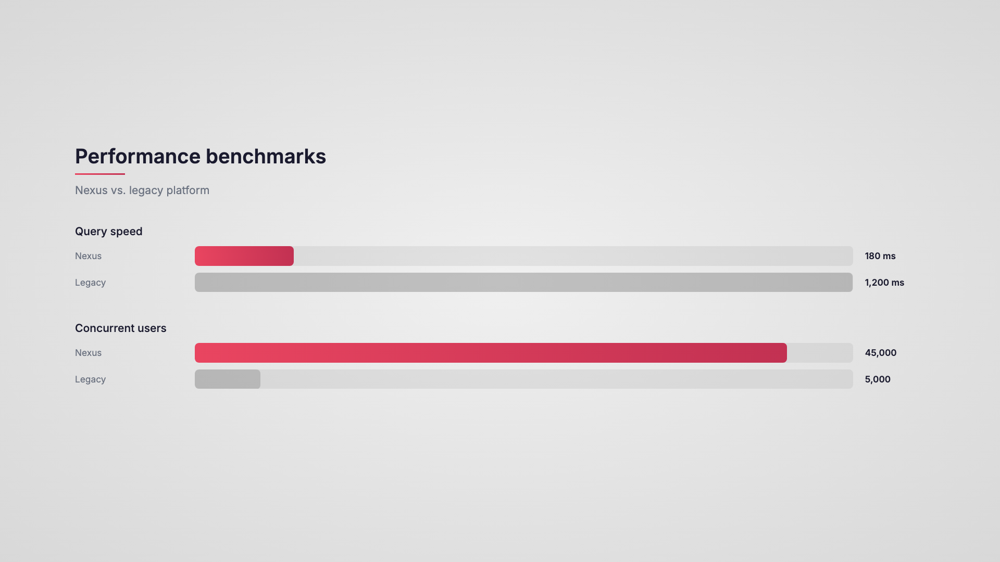
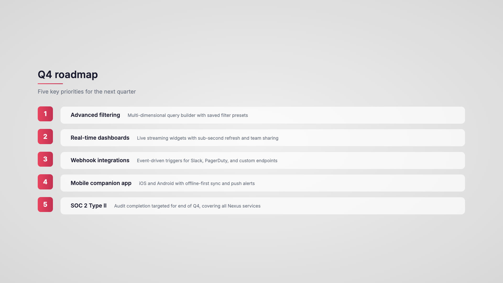

# SlideForge

Turn any text into broadcast-quality animated slide decks -- right from your terminal.

SlideForge is a [Claude Code](https://docs.anthropic.com/en/docs/claude-code) plugin that reads your content (meeting notes, reports, briefs) and generates self-contained HTML slides with CSS motion graphics. Optionally export to native, editable PowerPoint. Works with Claude Code and Claude Cowork.

### Example output

Generated from a [44-line product launch review](examples/demo-content.txt):

| | |
|---|---|
|  |  |
|  |  |
|  |  |



Every slide includes CSS entrance animations (fade, slide, scale, pop) with staggered timing. [View the demo content](examples/demo-content.txt) or [browse the generated HTML](examples/demo-output/).

---

## Installation

### As a plugin (recommended)

Clone the repo and point Claude Code at it:

```bash
git clone https://github.com/MarkSloane/slideforge.git
```

Then in Claude Code, load it with the `--plugin-dir` flag:

```bash
claude --plugin-dir path/to/slideforge
```

### Manual install

Or copy just the skill into your personal skills folder:

```bash
cp -r skills/slideforge ~/.claude/skills/slideforge
```

Claude Code will discover it automatically as `/slideforge`.

### Dependencies (optional, for PPTX export)

**Native PPTX** (editable text and shapes):

```bash
pip3 install python-pptx lxml
```

**Screenshot PPTX** (pixel-perfect images):

```bash
pip3 install playwright python-pptx
python3 -m playwright install chromium
```

---

## Usage

```bash
claude "/slideforge path/to/content.txt"
```

Or invoke it interactively:

```bash
claude "/slideforge"
```

Claude will then ask you to provide a file path or paste content directly.

### What happens

1. **Content analysis** -- SlideForge reads your text and plans 4-8 slides, choosing the best visual archetype for each.
2. **Slide plan review** -- You see a numbered list of slide titles and archetypes. Approve or adjust before generation.
3. **HTML generation** -- Each slide is written as a standalone HTML file with CSS animations (fade, slide, scale, pop) in `slideforge-output/slides/`.
4. **Player assembly** -- A lightweight presentation player is written to `slideforge-output/presentation.html`. Open it in any browser.
5. **Navigate** -- Arrow keys or spacebar to advance, `F` for fullscreen.
6. **PPTX export** -- Ask Claude for a PowerPoint and choose native (editable) or screenshot (pixel-perfect).

---

## Brand Theming

On first run, SlideForge checks for a saved theme at `~/.slideforge/themes/`. If none exists, it offers four setup options:

1. **Share a PDF brand guide** -- SlideForge reads it and extracts colors, fonts, and style automatically.
2. **Share a .pptx template** -- Colors and fonts are pulled from the PowerPoint theme XML.
3. **Provide hex codes** -- Just a primary and accent color.
4. **Use clean defaults** -- Start immediately with the built-in theme.

### Theme JSON format

Themes are stored as JSON files in `~/.slideforge/themes/`. Here is the default schema with built-in values:

```json
{
  "font": "Inter",
  "font_weights": "300;400;500;600;700",
  "font_import": "https://fonts.googleapis.com/css2?family=Inter:wght@300;400;500;600;700&display=swap",
  "primary_color": "#1a1a2e",
  "accent_color": "#e94560",
  "accent_gradient": "linear-gradient(90deg, #e94560, #c23152)",
  "secondary_text": "#6b7280",
  "background": "radial-gradient(ellipse at center, #f0f0f0 0%, #d8d8d8 100%)"
}
```

You can also include a `palette` object for extra named colors accessible via `sf.color("name")` in native PPTX scripts:

```json
{
  "palette": {
    "teal": "#0d9488",
    "amber": "#d97706",
    "indigo": "#4f46e5"
  }
}
```

---

## Slide Archetypes

SlideForge selects the best layout for each slide's content:

| Archetype | When to use |
|---|---|
| **Title Card** | Opening slide, section breaks. Large centered title with accent divider. |
| **Stat Cards** | Multiple metrics. 2-4 cards in a row with large numbers and labels. |
| **Stat Reveal** | Single KPI. One hero number with label and subtle glow. |
| **Bar Comparison** | Comparing values. Side-by-side horizontal bars with labels. |
| **Side-by-Side** | Before/after, us vs. them. Two columns with a divider. |
| **Numbered List** | Priorities, steps. Staggered items with accent number badges. |
| **Icon Cards** | Features, capabilities. Cards in a row with descriptions. |
| **Stacked Layers** | Components of a whole. Horizontal bars stacking vertically. |

All archetypes use the same animation vocabulary (fadeSlideUp, slideIn, fadeIn, scaleIn, popIn) and follow a consistent timing contract: 1-second front pad, staggered animation sequence, 2-second back pad.

---

## Native PPTX Toolkit

The `SlideForgeNative` class in `scripts/native_pptx.py` generates editable PowerPoint files with real text, shapes, and entrance animations. It auto-loads your brand theme.

### Quick start

```python
import sys, os
sys.path.insert(0, os.path.expanduser("~/.claude/skills/slideforge/scripts"))
from native_pptx import SlideForgeNative

sf = SlideForgeNative()
slide = sf.add_slide()

sf.add_textbox(slide, Inches(1), Inches(1), Inches(6), Inches(1),
               "Hello, SlideForge", font_size=Pt(36), bold=True)

sf.add_gradient_line(slide, Inches(1), Inches(2.2), Inches(3))

card = sf.add_card(slide, Inches(1), Inches(3), Inches(5), Inches(2.5))
sf.add_bullet_list(slide, Inches(1.3), Inches(3.3), Inches(4.4), Inches(2),
                   ["First point", "Second point", "Third point"])

sf.add_fade_stagger(slide, [card], start_delay=100, gap=60)
sf.save("output.pptx")
```

### API reference

| Method | Description |
|---|---|
| `add_slide()` | Blank slide with themed gradient background |
| `add_textbox(slide, left, top, w, h, text, ...)` | Styled text box |
| `add_multi_text(slide, left, top, w, h, runs)` | Text box with multiple styled runs |
| `add_bullet_list(slide, left, top, w, h, items, ...)` | Branded bullet list |
| `add_card(slide, left, top, w, h)` | Rounded rectangle with Apple-style shadow |
| `add_gradient_line(slide, left, top, w)` | Accent gradient divider (no shadow) |
| `add_gradient_bar(slide, left, top, w, h)` | Chart bar with gradient fill (no shadow) |
| `add_solid_bar(slide, left, top, w, h, color=)` | Solid-color chart bar (no shadow) |
| `add_bar_track(slide, left, top, w, h)` | Background track for bar charts |
| `add_badge(slide, left, top, w, h, text)` | Colored label badge (no shadow) |
| `add_fade(slide, shape, delay_ms=, duration_ms=125)` | Fade entrance animation |
| `add_fade_stagger(slide, shapes, start_delay=, gap=)` | Auto-stagger animations across a list |
| `add_fade_sequence(slide, [(shape, delay), ...])` | Explicit animation timing |
| `color("name")` | Look up a palette color by name |
| `save(path)` | Write the .pptx file |

### Design rules

- **Shadows**: Only on cards/boxes. Apple-style, approximately 90% transparency. Never on lines, bars, badges, or text.
- **Animations**: Snappy -- 125ms duration, 50-75ms stagger gaps.
- **Gradients**: Always horizontal (left-to-right) on lines and bars.
- **Layout**: Widescreen 16:9 (13.333 x 7.5 inches), 1-inch margins.
- **Text**: Sentence case by default.

---

## Screenshot PPTX

For pixel-perfect fidelity to the HTML slides (non-editable):

```bash
python3 ~/.claude/skills/slideforge/scripts/html_to_pptx.py \
  slideforge-output/slides \
  slideforge-output/presentation.pptx \
  --title "My Presentation"
```

Options: `--wait 5` (seconds for animations), `--scale 2` (retina), `--width 1920`, `--height 1080`.

---

## Project Structure

```
slideforge/
  .claude-plugin/
    plugin.json           # Plugin manifest (name, version, author)
  skills/
    slideforge/
      SKILL.md            # Skill definition (workflow, design system, templates)
      scripts/
        native_pptx.py    # SlideForgeNative toolkit for editable PPTX
        html_to_pptx.py   # Playwright screenshot-based PPTX exporter
  examples/
    demo-content.txt      # Sample input (44-line product launch review)
    demo-output/          # Generated HTML slides + player
  docs/
    screenshots/          # Slide screenshots for reference
```

---

## License

MIT -- see [LICENSE](LICENSE).

---

Built with [Claude Code](https://docs.anthropic.com/en/docs/claude-code) by Mark Sloane.
